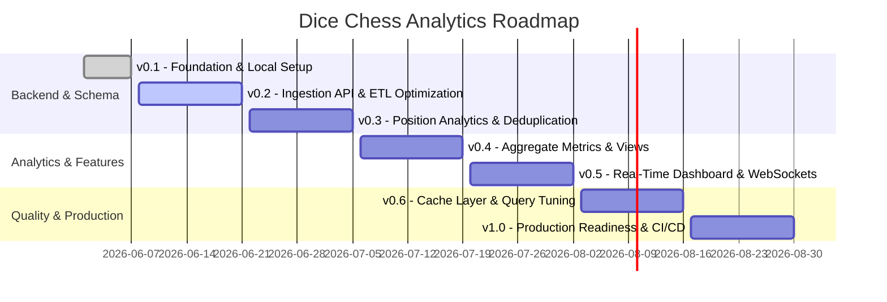

# Milestones & Roadmap

This page outlines the development roadmap and milestone targets for the `dicechess-analytics` project.

---

## Roadmap Overview

The development of `dicechess-analytics` is structured into progressive phases focusing first on data ingestion and deduplication, followed by analytics generation, real-time metrics streaming, and finally performance tuning and production readiness.

---

## Detailed Milestones

### **v0.1 - Foundation & Local Setup**
*   **Objective**: Establish core infrastructure, local development workflows, database schemas, and initial importer.
*   **Deliverables**:
    *   FastAPI & Pydantic boilerplate setup.
    *   PostgreSQL local database container config (`docker-compose.yaml`).
    *   Initial database schema migrations (`players`, `games`, `turns`, `game_events`, `positions`) managed by Alembic.
    *   Initial documentation site using MkDocs Material.
    *   Command tasks configured in `mise.toml`.

### **v0.2 - Ingestion API & ETL Optimization**
*   **Objective**: Implement transactional game saving API and optimize database writes for massive historical imports.
*   **Deliverables**:
    *   `POST /api/games` endpoints to ingest live game/turn results.
    *   Optimize ETL pipeline script (`importer.py`) to leverage async processing and batch inserts (`copy` / `execute_many`).
    *   Implement comprehensive Pytest unit and integration testing suite.

### **v0.3 - Position Analytics & Deduplication**
*   **Objective**: Deduplicate unique board states using FEN normalization and construct position analytics endpoints.
*   **Deliverables**:
    *   Position deduplication logic using FEN normalization.
    *   xxhash64 signed bigint hash mapping in PostgreSQL.
    *   Optimize index parameters for fast position queries.
    *   `GET /api/positions/{fen_hash}/analytics` endpoints returning win/draw rates, play frequency, and common continuation moves.

### **v0.4 - Aggregate Metrics & Materialized Views**
*   **Objective**: Generate complex historical aggregates and optimize long-running queries.
*   **Deliverables**:
    *   Player rating history graphs and opening explorer stats endpoints.
    *   Use PostgreSQL Materialized Views for heavy analytical queries.
    *   Game search endpoints supporting complex multi-column filters (ratings, termination type, openings, dates).

### **v0.5 - Real-Time Dashboard & WebSockets**
*   **Objective**: Enable real-time metrics visualization and WebSocket streaming.
*   **Deliverables**:
    *   WebSocket endpoint to stream live games and turns.
    *   Real-time system dashboard monitoring ingestion rate and active database connections.

### **v0.6 - Cache Layer & Query Tuning**
*   **Objective**: Performance optimizations under concurrent read/write loads.
*   **Deliverables**:
    *   Redis caching layer for position analytics and popular queries.
    *   Database query optimization using `EXPLAIN ANALYZE` and composite indexes.
    *   Load testing the ingestion server to handle peak concurrent traffic.

### **v1.0 - Production Readiness & CI/CD**
*   **Objective**: Finalize configuration for cloud deployment and automated workflows.
*   **Deliverables**:
    *   Optimized multi-stage Dockerfile for production server.
    *   GitHub Actions CI/CD workflows for automated formatting, testing, and deployment.
    *   Structured logging setup and monitoring tools (Prometheus/Grafana dashboard).
