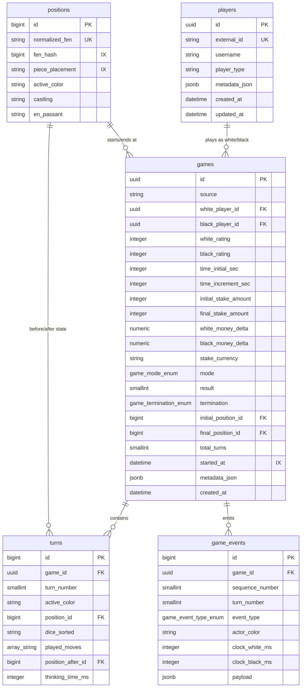

This document details the database schema, data models, and the position deduplication strategy used in `dicechess-analytics`.

---

## Entity Relationship (ER) Diagram

The system uses a highly normalized PostgreSQL schema designed to allow rapid analytics on moves and positions. Below is the Mermaid representation of the tables and their relations:



---

## Data Models Specification

### 1. Players (`players`)

A player profile — a human or an AI bot.

| Column | Notes |
| :--- | :--- |
| `id` | `UUID` primary key (internal). |
| `external_id` | `UNIQUE`. The player's id at the originating source. This is the **get-or-create key** used on ingestion. |
| `username` | Display name. Backed by a trigram GIN index (`ix_players_username_trgm`) for fast case-insensitive substring search. |
| `player_type` | `human` or `bot`. |
| `metadata_json` | Raw source-specific extras. |
| `created_at` / `updated_at` | Bookkeeping. |

Ratings are **not** stored here — they are dynamic and per-game, so they live on `games`
(`white_rating` / `black_rating`) as a snapshot at the time that game was played.

### 2. Positions (`positions`)

One row per **distinct board state** across all games — the heart of position analytics
(it lets millions of turns collapse onto a minimal set of unique positions).

| Column | Notes |
| :--- | :--- |
| `id` | `BIGINT` identity primary key. |
| `normalized_fen` | `UNIQUE`. The 4-field normalized FEN — the deduplication key (see [below](#position-deduplication-strategy)). |
| `fen_hash` | Signed `BIGINT` xxHash64 of `normalized_fen`, indexed (`ix_positions_fen_hash`) for fast equality lookups. |
| `piece_placement` | The placement field of the FEN (e.g. `rnbqkbnr/pppppppp/8/8/8/8/PPPPPPPP/RNBQKBNR`), indexed to support board-pattern queries. |
| `active_color`, `castling`, `en_passant` | The remaining normalized-FEN fields, split out for querying. |

### 3. Games (`games`)

One completed match.

| Column | Notes |
| :--- | :--- |
| `id` | `UUID` primary key. **Equal to the source's game id** — this is the idempotency key (re-ingesting the same game is a no-op). |
| `source` | Free-form origin label of the writer. |
| `white_player_id` / `black_player_id` | FK → `players` (nullable). |
| `white_rating` / `black_rating` | Integer rating snapshot at game time (nullable). |
| `mode` | `game_mode_enum` — see [Enumerated Types](#enumerated-types). |
| `result` | `SMALLINT`: `1` White win, `-1` Black win, `0` draw, `NULL` unknown. |
| `termination` | `game_termination_enum`, `NOT NULL DEFAULT 'unknown'` — *how* the game ended. |
| `initial_position_id` / `final_position_id` | FK → `positions` — the board at the start and at the end. |
| `total_turns` | Number of turns. |
| `time_initial_sec` / `time_increment_sec` | Time control. |
| `initial_stake_amount` / `final_stake_amount` | The pot; the final amount can differ from the initial because of **doubling**. |
| `white_money_delta` / `black_money_delta` | `NUMERIC` actual profit/loss per player. Stored independently (not just `±x`) because the site takes a rake, so the two deltas are **not symmetric**. |
| `stake_currency` | Currency of the stakes. |
| `started_at` | Indexed (`ix_games_started_at`). |
| `metadata_json` | Raw source-specific extras. |

### 4. Turns (`turns`)

One turn = a dice roll plus up to three micro-moves. `UNIQUE (game_id, turn_number)`.

| Column | Notes |
| :--- | :--- |
| `game_id` | FK → `games` (`ON DELETE CASCADE`). |
| `turn_number` | 1-based, ordered within the game. |
| `active_color` | `w` or `b` — who is to move. |
| `position_id` | FK → `positions`: the board **before** the turn. |
| `dice_sorted` | The three rolled dice as sorted digits `1`–`6` (`1`=pawn … `6`=king), e.g. `"125"`. |
| `played_moves` | `VARCHAR(5)[]` of UCI micro-moves, e.g. `["e2e4","g1f3"]`. Up to three; **empty** when the player had no legal move. |
| `position_after_id` | FK → `positions`: the board **after** the turn. Positions are recorded at turn boundaries, not per micro-move. |
| `thinking_time_ms` | Time spent on the turn. |

### 5. Game Events (`game_events`)

A side-ledger of non-move events (doubling, draw offers). `UNIQUE (game_id, sequence_number)`.

| Column | Notes |
| :--- | :--- |
| `game_id` | FK → `games` (`ON DELETE CASCADE`). |
| `sequence_number` | Order within the game. |
| `turn_number` | The turn the event occurred on (nullable). |
| `event_type` | `game_event_type_enum` — see [below](#enumerated-types). |
| `actor_color` | `w` / `b` — who triggered it. |
| `clock_white_ms` / `clock_black_ms` | Clocks at the moment of the event. |
| `payload` | `JSONB`, e.g. `{"bank": 800}` for a doubling event. |

:::note[Why doubling events matter]
In the commercial (`x2`) variant, deciding **when to offer, accept, or decline a double**
is one of the most consequential skills. These events are therefore a first-class
analytical dimension: a future capability will score the actual decision against the
engine's win-probability (`KingCaptureProbability`) — so the ledger is captured faithfully,
with the bank/stake context in `payload`.
:::

---

## Enumerated Types

Small, closed value sets are modelled as PostgreSQL enums for integrity. Writers map their
source's vocabulary onto these canonical values (keeping the schema source-agnostic).

### `game_mode_enum`

| Value | Meaning |
| :--- | :--- |
| `classic` | Standard game. |
| `x2` | Commercial game with doubling enabled. |

### `game_termination_enum`

How a game ended. Defaults to `unknown`; it is known precisely for engine-driven games
and inferred for historical imports (e.g. a king-capture on the last move → `king_captured`).

| Value | Meaning |
| :--- | :--- |
| `king_captured` | The opponent's king was captured — the Dice Chess win condition. |
| `timeout` | A player's clock reached zero. |
| `resign` | A player resigned. |
| `draw_agreement` | A draw was agreed by both players. |
| `double_declined` | A doubling offer was declined, ending the game as a loss. |
| `unknown` | Not determined (default; all legacy rows). |

### `game_event_type_enum`

| Value | Meaning |
| :--- | :--- |
| `DOUBLE_OFFER` | A player proposes to double the stake. |
| `DOUBLE_ACCEPT` | The opponent accepts; `payload` carries the new bank (e.g. `{"bank": 800}`). |
| `DOUBLE_DECLINE` | The opponent declines — an immediate loss. |
| `DRAW_OFFER` | A player offers a draw. |
| `DRAW_ACCEPT` | The opponent accepts the draw. |

---

## Schema Evolution

The schema is managed by **Flyway** (`src/main/resources/db/migration/`). `V1` is the
baseline that mirrors the original production schema (created by the previous app's
migrations); the production database is **baselined** at `V1` (`baselineOnMigrate`), so on
production only `V2` onward run, while fresh databases (tests, new environments) get the
full chain. `V2` converted `mode` / `termination` to the enums above.

---

## Position Deduplication Strategy

To prevent storing the same board layout multiple times (which would quickly bloat the database), `dicechess-analytics` normalizes and hashes FEN strings before inserting them.

### FEN Normalization

A standard chess FEN string contains 6 fields:
`[piece placement] [active color] [castling rights] [en passant target] [halfmove clock] [fullmove number]`

For deduplication, the halfmove clock and fullmove number are stripped, since they do not change the tactical properties of the position. The normalized FEN only contains the first 4 fields:

```scala
def normalizeFen(fen: String): String =
  // filter: unlike Python's str.split(), Java's split keeps empty
  // elements produced by leading or consecutive whitespace
  val parts = fen.split("\\s+").filter(_.nonEmpty).take(4)
  (parts ++ Array.fill(4 - parts.length)("-")).mkString(" ")
```

FEN parsing and validation themselves are the engine's job: `dicechess-engine-scala`
is the single source of truth for game rules, and the backend consumes it as a JVM
library rather than re-implementing any chess logic.

### xxHash64 Signed Integer Digests

We compute the hash of the normalized FEN with `xxHash64` (seed 0) — extremely fast, very
low collision rate. PostgreSQL's `bigint` is a signed 64-bit integer — exactly the JVM's
`Long` — so the digest's raw bits map onto the column directly, with no unsigned-to-signed
conversion step:

```scala
import net.openhft.hashing.LongHashFunction

def fenHash(normalizedFen: String): Long =
  LongHashFunction.xx().hashBytes(normalizedFen.getBytes(StandardCharsets.UTF_8))
```

This is **bit-compatible** with the digests already stored for the historical data
(originally produced by Python's `xxhash.xxh64(...).intdigest()`), verified by cross-checking
sample rows — so old and new positions share one consistent `fen_hash` space.

### Resolution Flow

When saving a turn or game, the backend follows a "get-or-create" loop (the historical
import already populated the `positions` table this way; the `POST /api/games`
endpoint applies the same flow to live games):

1. **Normalize FEN**: Strip move counts.
2. **Lookup by Normalized FEN**: Query the `positions` table using the unique `normalized_fen` field.
3. **Insert if Missing**: If the position is not in the database, calculate its signed `xxhash64` hash and insert the new `Position` record.
4. **Reference ID**: Use the resolved position ID as the foreign key in `turns` and `games`.
